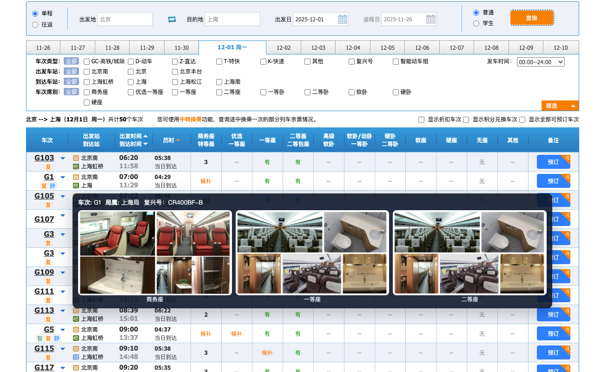

# 插件安装
> 点击图标进入插件中心安装

# 12306-seat-viewer
列车局属与动车席位图鉴

## 为什么有这个项目呐！！！
常年在浙江坐动车偶遇南昌局的老旧动车，在体验一番南昌局惊艳一等座体验之后人生就与南昌局结下了不解之缘时常被南昌局一等座绝杀，南昌局有些一等座堪比上海局绿皮，哪里有一等座靠背不能调整的，怎么会有插座实在头上的，诶充电器砸我头上了。

南昌局一等座难受就算了，有时候买不到一等座就买二等座，二等座比绿皮还绿皮啊！！！，被南昌局折磨最久的是从浙江宁波到福建福州的。

举不完全统计本人对南昌局以下动车班次充满恨意：`D381`,`D381`,`D3171`,`D3233`,`D3145`,`D3307`,`D382`,`D3234`,`D3302`,`D3292`,`D3296`。

这个项目至少可以在网页端买票的时候查看座位和分局信息，让你免受花高铁的钱体验绿皮的痛苦。

南昌局简直是浙江沿海高铁杀手，怎么会有南昌局的车在浙江跑啊！！！

## 隐私说明
- 不使用第三方技术栈
- 不收集用户个人数据
- 不向服务器上传数据
- 不存储任何用户数据
